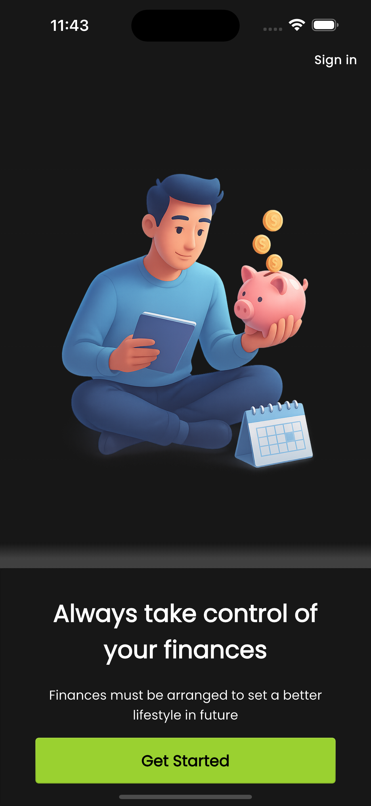

# 🤑 Flutter Expense Tracker

Welcome to **Flutter Expense Tracker**, where your money gets tracked faster than you can say "Where
did it all go?" 💸

## 🚀 Getting Started

This project is your gateway to managing expenses like a pro (or at least pretending to). Whether
you're saving for a rainy day 🌧️ or just trying to figure out why your coffee budget is higher than
your rent ☕, this app has got you covered.

### 🚀 Setting Up and Running the Project Locally

Follow these steps to get the project up and running on your local machine:

1. **Clone the Repository**:

   ```bash
   git clone https://github.com/your-username/flutter_expense_tracker.git
   cd flutter_expense_tracker
   ```

2. **Install Dependencies**:
   Make sure you have Flutter installed. If not, follow
   the [Flutter installation guide](https://docs.flutter.dev/get-started/install). Then, run:

   ```bash
   flutter pub get
   ```

3. **Run the App**:
   Connect a device or start an emulator, then execute

   ```bash
   flutter run
   ```

### 📚 Resources to Get You Started

If you're new to Flutter (or just need a refresher because you forgot everything over the weekend),
here are some handy resources:

- [Lab: Write your first Flutter app](https://docs.flutter.dev/get-started/codelab) - Because
  everyone starts somewhere. 🛠️
- [Cookbook: Useful Flutter samples](https://docs.flutter.dev/cookbook) - Recipes for success (and
  maybe some debugging tears). 🧑‍🍳

### 🛠️ Development Help

Need help? Flutter's got your back! Check out the [online documentation](https://docs.flutter.dev/)
for tutorials, samples, and guidance. It's like having a mentor, but without the awkward small talk.
🤓

---

## 💡 Why Use This App?

- **Track Expenses**: Know where your money is going (spoiler: it's probably food). 🍔
- **Stay Organized**: Because chaos is only fun in in the Warhammer universe, not in finances.🔥
- **Save Smarter**: Turn those pennies into dollars. Or at least try. 🪙➡️💵

---

## 📷 Screenshots

- ### Start Screen



- ### Sign Up


- ### Login


- ### Home Screen


- ### Add Expense Form


- ### Statistics Screen


- ### Wallets List


- ### Add Wallet Form


- ### User Profile Screen


---

## 🗓️ Roadmap

Here's what we plan to add next (because who doesn't love a good to-do list?):

- [ ] Implement the backend (because we need a place to store all those
      "I spent how much on coffee?" moments) ☕💾
- [ ] Add notifications for expenses (because we all need a nudge sometimes) 📅
- [ ] Implement light mode (because dark mode isn't for everyone) 🌞

## 🧑‍💻 Contributing

Got a feature idea or found a bug? Open an issue or submit a pull request. Let's make this app so
good, even your wallet will thank you. 🙌

---

## 📜 License

This project is licensed under the MIT License. Because sharing is caring. ❤️

---

Happy tracking, and may your expenses always be in check! 🧾✨
